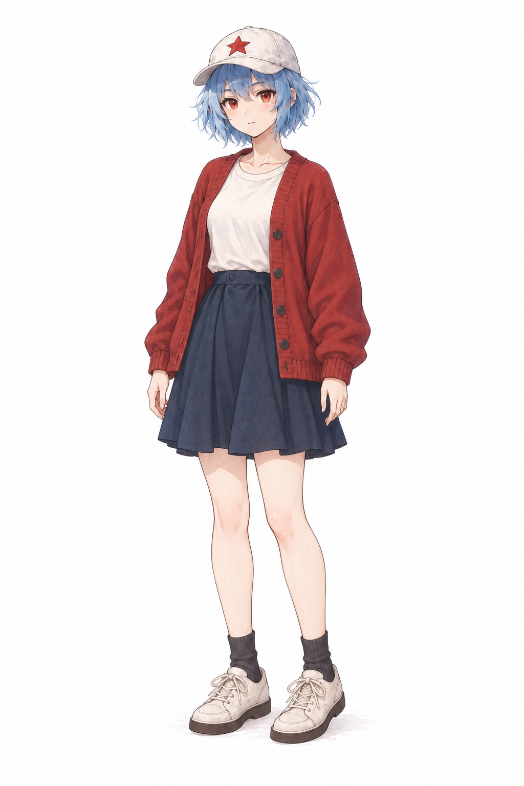
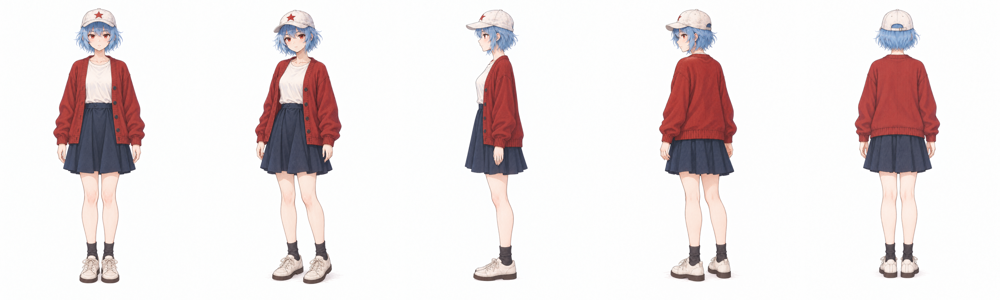
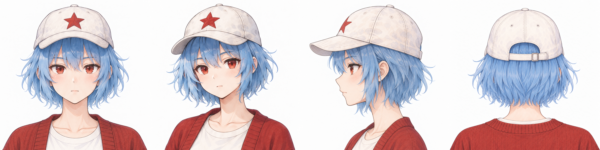
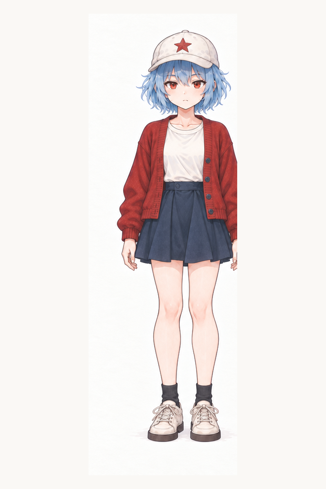
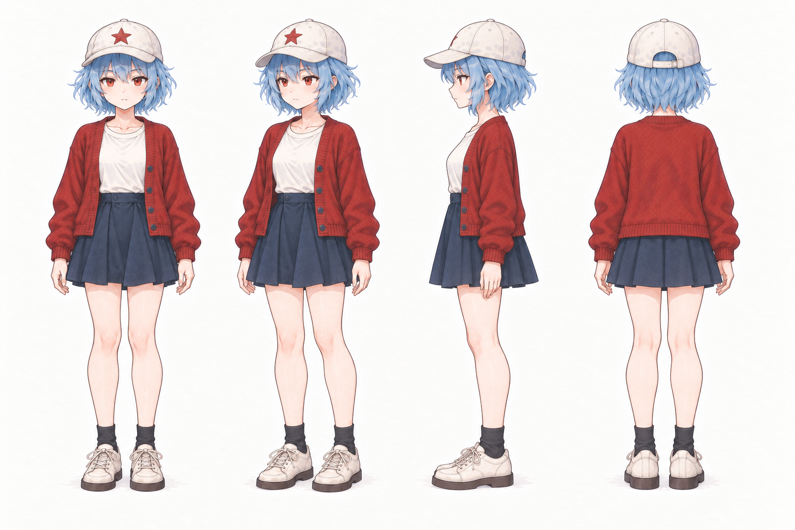
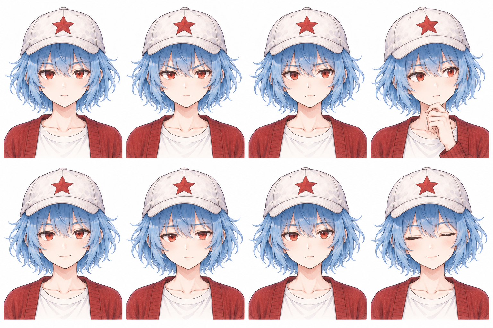
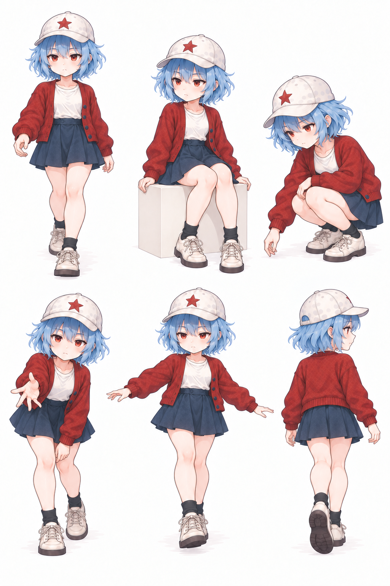
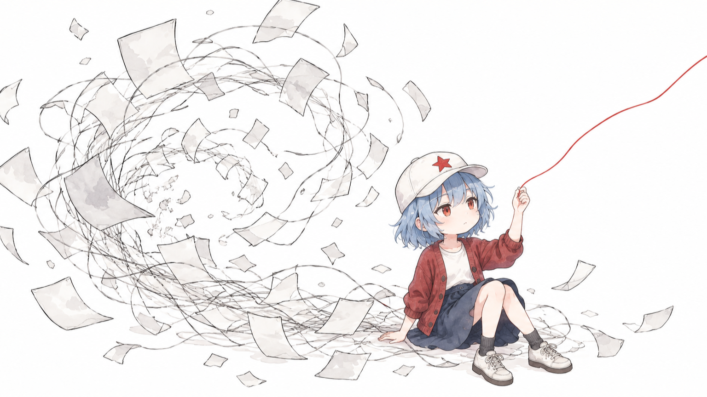
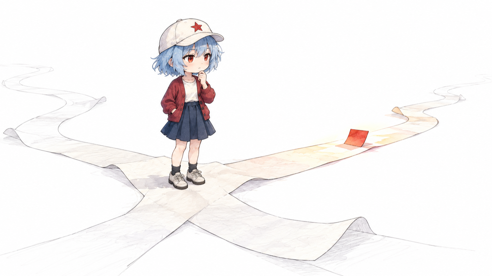
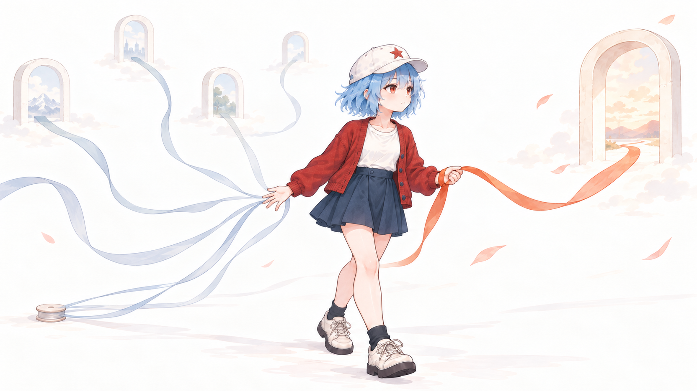

# 凯冰文章配图

> 用固定的凯冰 V2 日系休闲形象，把中文文章中的判断、状态和关系转成清爽、有叙事感的正文插图。

16:9 横版 · 白底轻手绘 · 日系休闲少女 · 少字或无字 · Codex Skill

## 当前版本是什么

这是一个面向中文文章正文配图的 Codex Skill。它先理解文章中的认知锚点，再为每个锚点发明一个可见场景，让凯冰自然地经历、观察、选择或参与其中。

当前正式支持：

- 分析文章并规划 shot list
- 生成单张或成组的正文配图
- 修改已有正文图中的文字、留白或角色参与方式
- 保持凯冰 V2 在不同文章场景中的身份一致性

当前不把封面和角色设定稿伪装成正文配图处理。它们需要独立的画幅、信息层级和验收规则，将作为后续模式扩展。

## 凯冰 V2

凯冰是一位清新、安静、有主见的日系休闲少女。她不是战士、工作人员或内容助手，也不是贴在画面角落的吉祥物。

稳定识别点：

- 白色休闲棒球帽，正面红色五角星
- 冰蓝色齐下巴短发
- 柔和暗红色针织开衫
- 象牙白上衣与藏青短裙
- 红橙色眼睛与克制、自然的表情

### V2.1 身份母版



### 五视图结构



### 头部四视图



### V2.2 正文轻 Q 形态母版



### V2.2 正文轻 Q 形态四视图



V2.2 不再把标准角色整体压矮。它在保持成年脸、总高度感和清楚骨架的前提下，相对放大头部、适度缩短躯干与四肢，并同步缩短开衫和裙长。四个角度来自同一张统一画布，服装节点与脚底线保持一致。

### V2.2 表情与动作范围





## 正文配图效果

### 信息过载：从噪声中牵住一根清晰线索



### 决策路径：在分岔处发现一个值得靠近的方向



### 选择与放下：牵住一个方向，同时放开其他可能



这些图片用于校准角色身份、线条、留白和参与方式，不是可复用的构图模板。每篇文章都应重新发明隐喻。

## 视觉原则

- 默认 16:9 横版，白色或极浅暖白背景
- 轻而自然的手绘线条，少量克制水彩
- 一张图只表达一个核心关系
- 凯冰通常占画面约 15%–30%
- 默认无文字；确有必要时只使用 1–3 个短中文标注
- 凯冰可以经历、观察、选择、同行或轻微影响场景，不必每次操作机器
- 不做 PPT、复杂架构、真实 UI、战斗海报或角色站桩图

### 固定身份，开放表达

- 固定凯冰的脸、帽星、发型、服装结构、配色和轻 Q 身体逻辑。
- 不固定每篇文章的隐喻物件、动作、观察角度、角色站位或参与方式。
- 先从文章发明隐喻，再按需加载最少的角色参考；不能从已有姿势反向套用文章。
- 表情与动作单图是可选纠偏样本，不是模板清单。同一语义有多个合格方案时，应保留变化并避免连续复用。

## 安装

```bash
git clone https://github.com/ruijayfeng/kevinbee-illustrations.git
cd kevinbee-illustrations
mkdir -p "${CODEX_HOME:-$HOME/.codex}/skills"
cp -R ./kevinbee-illustrations "${CODEX_HOME:-$HOME/.codex}/skills/"
```

安装后可以这样调用：

```text
Use $kevinbee-illustrations 为这篇中文文章规划并生成几张凯冰 V2 正文配图。
```

## 使用方式

### 只规划，不生图

```text
Use $kevinbee-illustrations 先不要生成图片。
分析下面这篇文章，挑选真正值得视觉化的认知锚点，给出 4–6 张 shot list。

<粘贴文章>
```

### 直接生成

```text
Use $kevinbee-illustrations 为下面这篇文章生成 4 张正文配图。
保持凯冰 V2 形象一致；默认无文字，每张只表达一个核心关系。

<粘贴文章>
```

### 单个观点

```text
Use $kevinbee-illustrations 为这个观点生成一张正文配图：

真正的选择不是找到最亮的路，而是放弃其他同样可能的路。
```

### 修改已有图片

```text
Use $kevinbee-illustrations 编辑这张图：
保持凯冰身份、姿态和核心隐喻不变，只删除错误文字，不新增物件。
```

更多调用示例见 [examples/prompts.md](examples/prompts.md)。

## Skill 的工作方式

1. 找出文章的核心判断、转折和关系变化
2. 选择少量真正值得配图的认知锚点
3. 为当前文章发明新的物理场景
4. 让凯冰自然进入场景，而不是给她安排固定工作
5. 标准与近景使用 V2.1 身份层，正文全身使用 V2.2 轻 Q 层，不混用会冲突的比例图
6. 检查画幅、身份、参与方式、原创性和文字
7. 保存原图与最终 16:9 版本

## 目录结构

```text
.
├── README.md
├── examples/
│   └── prompts.md
├── docs/
│   ├── character-direction-v2.md
│   └── upstream-analysis.md
├── archive/
│   └── legacy-v1/                # 旧战斗形象与旧案例，不进入默认上下文
└── kevinbee-illustrations/
    ├── SKILL.md
    ├── agents/
    │   └── openai.yaml
    ├── assets/
    │   ├── manifest.yaml
    │   ├── ip-reference/
    │   └── article-examples/
    └── references/
        ├── ip-core.md
        ├── article-body-style.md
        ├── article-body-prompt.md
        ├── composition-patterns.md
        └── qa-checklist.md
```

真正安装到 Codex 的目录是 `kevinbee-illustrations/`。

## 设计上的单一真值

- 凯冰是谁：只由 `references/ip-core.md` 定义
- 正文图长什么样：由 `references/article-body-style.md` 定义
- 如何构造提示词：由 `references/article-body-prompt.md` 定义
- 如何发明隐喻：由 `references/composition-patterns.md` 定义
- 如何验收：由 `references/qa-checklist.md` 定义
- 哪张图该在何时加载：由 `assets/manifest.yaml` 定义

这样修改角色服装或气质时，不必再同步五份互相重复的规则。

## 上游与署名

本项目基于 [helloianneo/ian-xiaohei-illustrations](https://github.com/helloianneo/ian-xiaohei-illustrations) 演化而来，继承了“认知锚点、一图一义、物理隐喻”的文章配图方法，并重新设计了 KevinBee 角色与生成结构。

详细溯源与差异分析见 [docs/upstream-analysis.md](docs/upstream-analysis.md)。

作者：凯冰（KevinBee）

- GitHub：[ruijayfeng](https://github.com/ruijayfeng)
- 微信：`STAR2023415`
- 邮箱：`fz.dev@foxmail.com`

## License

MIT License。详见 [LICENSE](LICENSE) 与 [NOTICE.md](NOTICE.md)。
