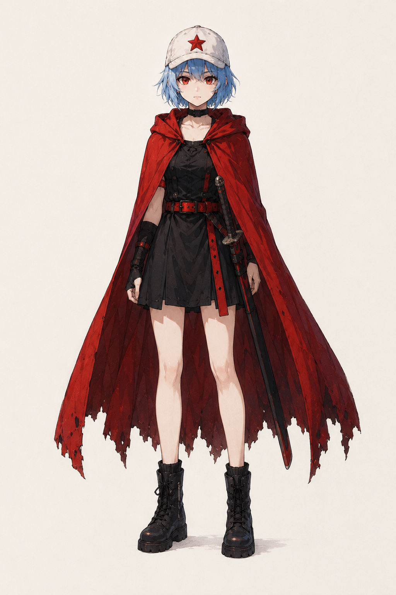
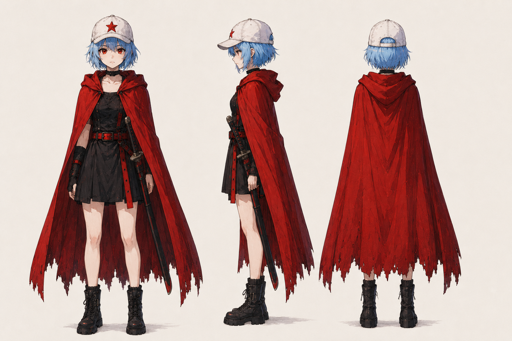
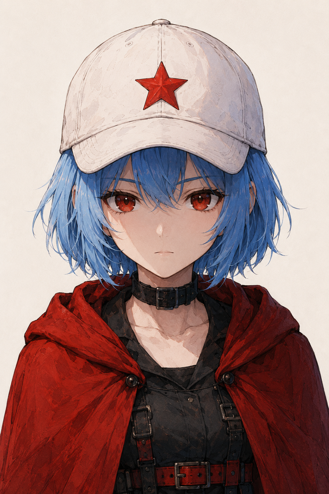
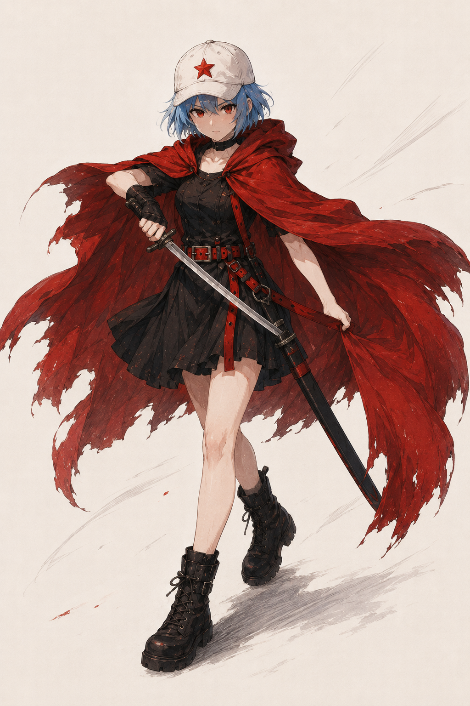
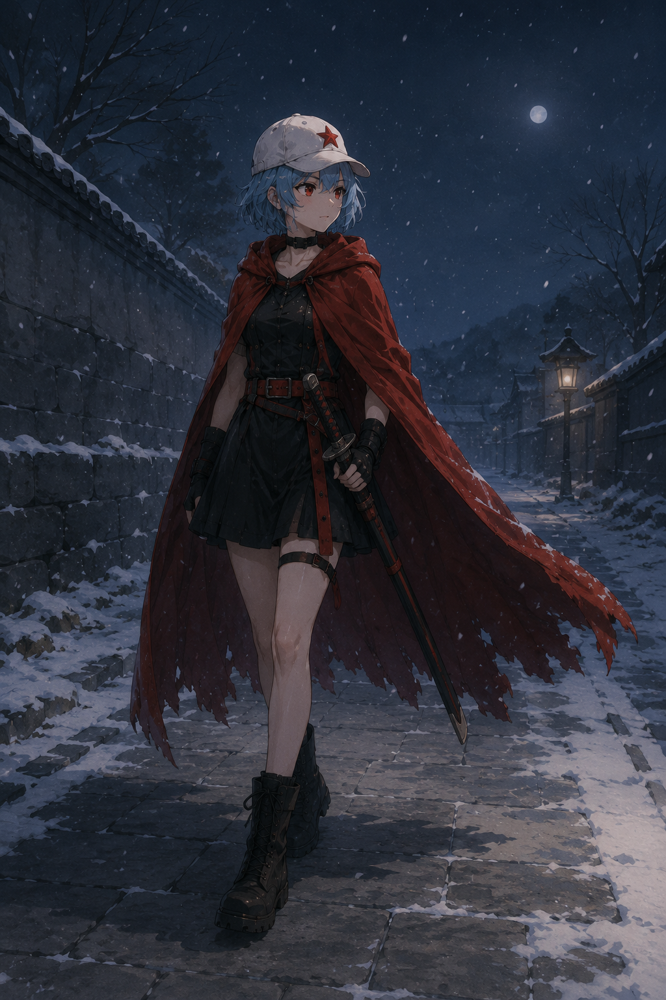
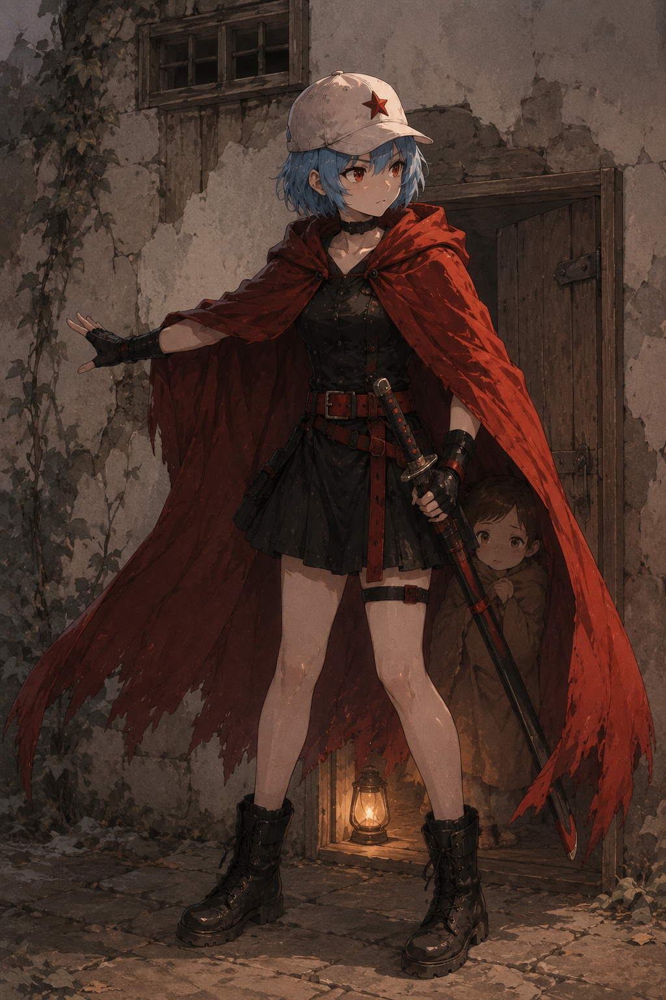
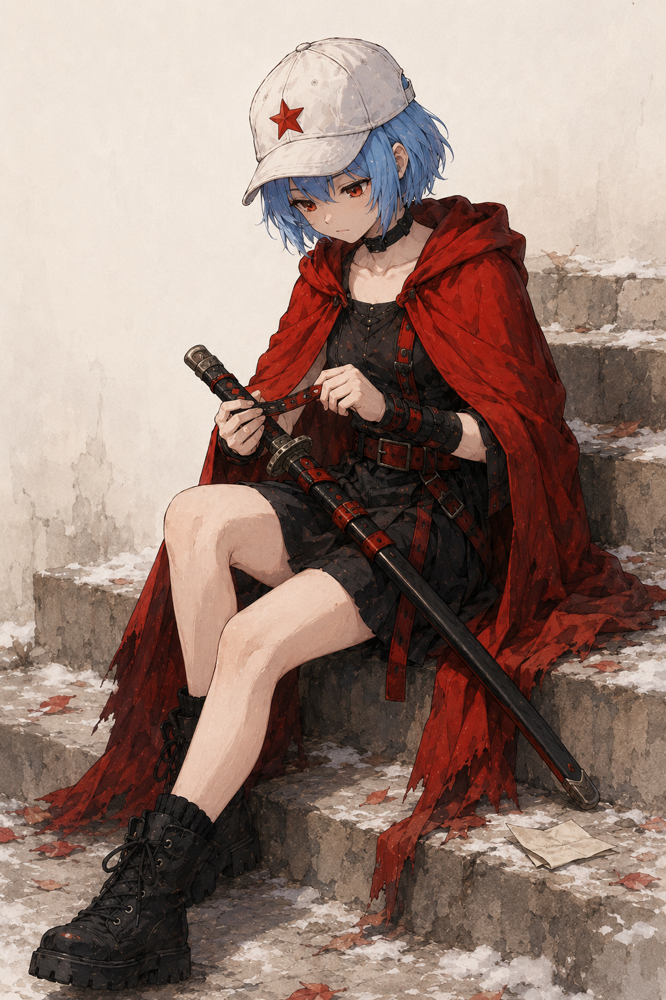
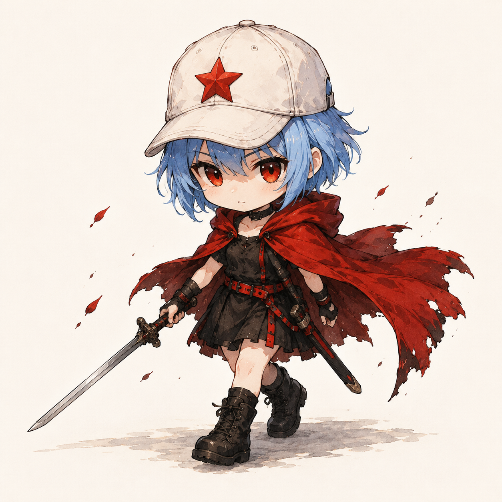

# 凯冰文章手绘隐喻插图

> 把中文文章里的判断、流程、状态和隐喻，变成一张张由凯冰参与的白底手绘正文配图。
>
> 16:9 横版 | 凯冰 IP | 纯白手绘 | 少量红橙蓝中文批注 | Codex Skill

---

## 这个仓库是什么

凯冰文章手绘隐喻插图是一个 Codex Skill，用来指导 AI Agent 为中文文章、帖子、博客、Notion 文档和方法论内容生成正文配图。

它不是通用插画 prompt，也不是 PPT 信息图模板。它的核心目标是：先理解文章里的认知锚点，再把其中一个判断、流程、结构、状态或隐喻，变成一张有记忆点的 16:9 手绘解释图。

默认视觉 IP 是“凯冰”：白帽红星、冰蓝短发、猩红斗篷和黑色战斗服的 Q 版日系少女。凯冰不是立绘海报中的装饰角色，而是在手绘隐喻里认真操作、修补、连接和守护结构的行动主体。

一句话：**让 AI 不只是“配一张图”，而是把文章里的一个关键认知动作画出来。**

---

## 适合谁用

特别适合：

- 写中文文章，需要正文配图和文章插图的人
- 做知识型内容、方法论内容、AI 工作流内容的人
- 想把抽象判断画成具体隐喻的人
- 想要一种比 PPT 信息图更轻、更怪、更有个人识别度的配图风格的人
- 用 Codex 做内容生产，希望稳定复用一套视觉语言的人

不适合：

- 想要商业插画、品牌 KV 或精致扁平插画的人
- 想要传统 PPT 信息图、复杂架构图或流程图的人
- 想要儿童卡通、可爱 IP、表情包风格的人
- 想把大量正文、长段解释或完整课程页塞进一张图里的人
- 需要严格可编辑矢量源文件的人

---

## 它会产出什么

默认输出：

- 16:9 横版正文配图
- 一篇文章的 4-8 张 shot list
- 每张图的主题、核心意思、结构类型、凯冰动作和中文标注建议
- 最终 PNG 图片，保存到 workspace 的 `assets/<article-slug>-illustrations/`

默认不输出：

- PPTX / PDF / Keynote
- SVG / HTML / Canvas 可编辑图
- 商业海报或封面 KV
- 大段文字型信息图

---

## 视觉风格

这个 skill 默认使用“凯冰文章手绘隐喻配图”风格：

- 纯白背景，不要纸纹、米色、阴影、渐变
- 黑色手绘线稿，细线，轻微抖动；凯冰和关键物件可有克制的柔和水彩上色
- 大量留白，主体只占画面约 40%-60%
- 少量红色、橙色、蓝色中文手写批注
- 一张图只表达一个核心动作、结构、状态或隐喻
- 凯冰必须参与核心动作，不能只是装饰或角色海报主体
- 低科技、略带荒诞、清爽而坚韧；Q 版只改变比例，不卖萌、不幼稚

---

## 示例效果

### 标准全身立绘



### 三视图设定



### 半身情绪肖像



### 拔剑战斗



### 夜巡独行



### 守护姿态



### 静态日常



### Q版动作样例



这些图片是风格校准样例，不是构图模板。使用时应该从当前文章重新发明隐喻，不要照抄旧案例的物件和构图。

---

## 安装

克隆仓库：

```bash
git clone https://github.com/ruijayfeng/kevinbee-illustrations.git
cd kevinbee-illustrations
```

复制 skill 到 Codex skills 目录：

```bash
mkdir -p "${CODEX_HOME:-$HOME/.codex}/skills"
cp -R ./kevinbee-illustrations "${CODEX_HOME:-$HOME/.codex}/skills/"
```

安装后，在 Codex 里使用：

```text
Use $kevinbee-illustrations 为这篇中文文章设计并生成 5 张凯冰手绘隐喻正文配图。
```

---

## 怎么用

### 只做配图规划

```text
Use $kevinbee-illustrations 先不要生图。
请分析下面这篇文章哪里值得配图，输出 5 张左右的 shot list。
每张图写清楚：放在哪段后、主题、核心意思、结构类型、凯冰在做什么、建议中文标注词。

<粘贴文章>
```

### 直接生成正文配图

```text
Use $kevinbee-illustrations 把下面这篇文章生成 4 张凯冰手绘隐喻正文配图。
要求：16:9 横版、纯白背景、黑色手绘线稿、少量红橙蓝中文手写批注。

<粘贴文章>
```

### 为单个概念生成一张图

```text
Use $kevinbee-illustrations 为“信任不是喊出来的，而是一块证据一块证据铺过去”生成一张正文配图。
画面要怪诞但清爽，凯冰必须承担核心动作，白帽红星清晰可见，不能画成战斗海报。
```

### 去掉图里的标题或错误文字

```text
Use $kevinbee-illustrations 帮我编辑这张图，去掉左上角的“流程图”标题，其他内容保持不变。
```

更多示例见 [examples/prompts.md](examples/prompts.md)。

---

## 工作流程

这个 skill 的流程是：

1. 读取文章、Markdown、Notion 内容、截图或用户给的主题
2. 提炼核心观点、认知转折、流程结构和适合视觉化的段落
3. 先输出 shot list：每张图只选一个认知锚点
4. 为每张图选择结构类型：Workflow、系统局部、前后对比、角色状态、概念隐喻、方法分层、地图路线或小漫画分镜
5. 重新发明一个低科技、怪诞但成立的物理隐喻
6. 让凯冰承担核心动作
7. 每张图单独调用图像模型生成
8. 按 QA checklist 检查：白底、留白、凯冰动作与红星白帽、中文标注、非 PPT 感、非旧案例复刻
9. 保存最终 PNG，并报告用途和路径

---

## 目录结构

```text
.
├── README.md
├── LICENSE
├── NOTICE.md
├── examples/
│   ├── images/
│   │   ├── 01-standard-full-body.png
│   │   ├── 02-three-view-turnaround.png
│   │   └── ...
│   └── prompts.md
└── kevinbee-illustrations/
    ├── SKILL.md
    ├── agents/
    │   └── openai.yaml
    ├── assets/
    │   └── examples/
    └── references/
        ├── style-dna.md
        ├── kevinbee-ip.md
        ├── composition-patterns.md
        ├── prompt-template.md
        └── qa-checklist.md
```

真正需要安装到 Codex 的是子目录：

```text
kevinbee-illustrations/
```

根目录的 README、LICENSE、NOTICE 和 examples 是 GitHub 分享文档。

---

## 注意事项

- 图片里的中文文字越短越稳定。
- 每张图只讲一个核心结构，不要把文章做成说明书。
- 凯冰必须承担核心动作；如果去掉凯冰画面仍然完全成立，说明凯冰太装饰了。
- 示例图只用于校准线条密度、留白、颜色克制、凯冰参与方式和红星白帽识别点，不要复刻构图。
- AI 图像模型可能出现错字、幻觉标签、风格漂移或多余标题，生成后需要检查。
- 如果中文错字严重，优先减少标注词并重生成。

---

## 相关项目

- [Ian Handdrawn PPT](https://github.com/helloianneo/ian-handdrawn-ppt) — 中文手绘技术 PPT-style 页面图生成 Skill
- [Awesome Claude Code Skills](https://github.com/helloianneo/awesome-claude-code-skills) — Claude Code Skills / Agents / Plugins 精选合集
- [Obsidian + Claude AI Second Brain](https://github.com/helloianneo/obsidian-ai-second-brain) — Obsidian + Claude AI 个人知识库搭建指南

---

## 关于作者

**凯冰 (KevinBee)** — 产品设计师 / 一人公司实践者 / AI Builder

用 AI 团队打造一人公司。

- GitHub: [ruijayfeng](https://github.com/ruijayfeng)
- X/Twitter: <https://github.com/ruijayfeng>
- 微信: `STAR2023415`
- 邮箱: fz.dev@foxmail.com

---

## 继续探索

这套凯冰配图 Skill，用于把文章里的抽象判断转化为可识别的手绘隐喻插图。

如果你也在用 AI 做内容、知识库、工作流或产品化，可以继续看我的 GitHub：[ruijayfeng](https://github.com/ruijayfeng)。

只想先观察，可以关注我的 [X/Twitter](https://github.com/ruijayfeng)。

想了解 Indie Builders Club，加微信：`STAR2023415`，备注「OPC」。

也可以直接搜索微信：`STAR2023415`。

---

## License

MIT License. See [LICENSE](LICENSE).

---

## 关于本项目（开源署名与迁移）

本项目由「Kaibing 手绘隐喻插图」更名迁移为「KevinBee 手绘隐喻插图」，保留开源署名。原仓库地址 <https://github.com/ruijayfeng/kaibing-illustrations> 已重定向至当前仓库 <https://github.com/ruijayfeng/kevinbee-illustrations>。
