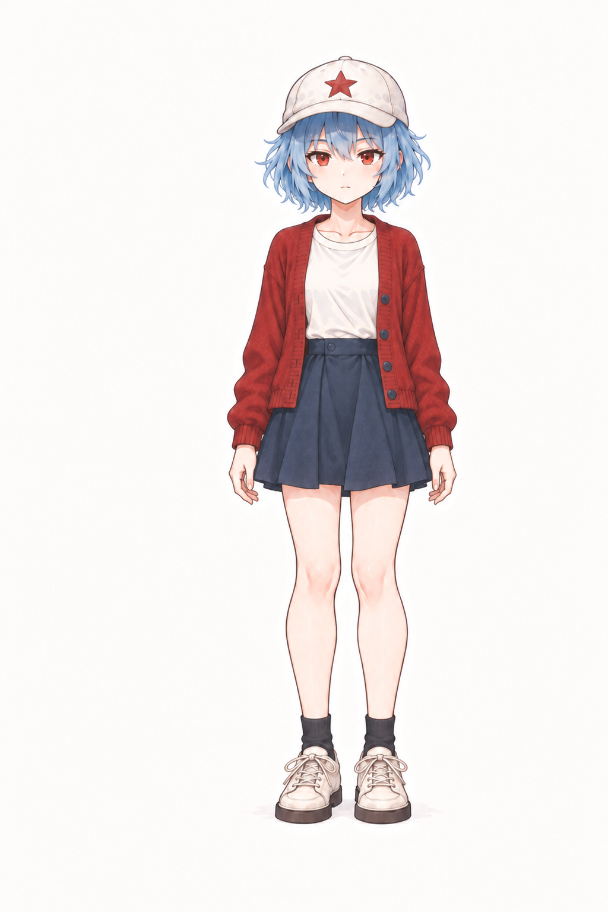
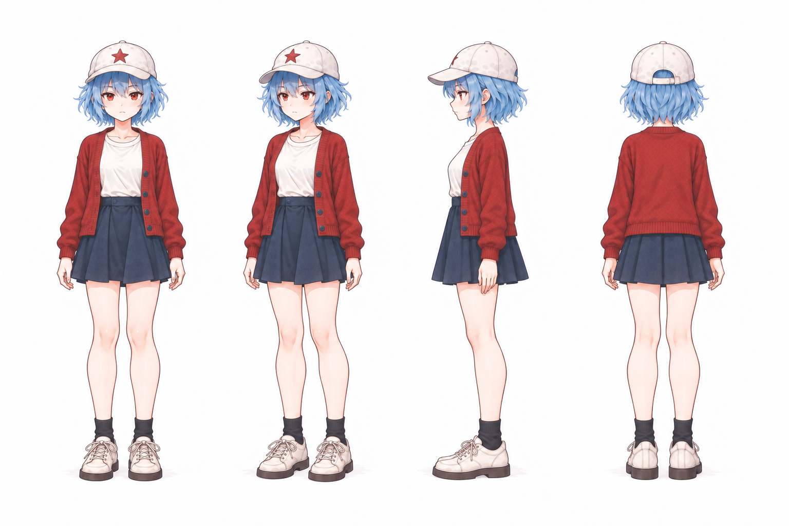
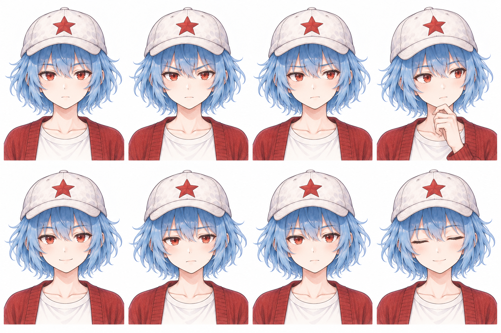
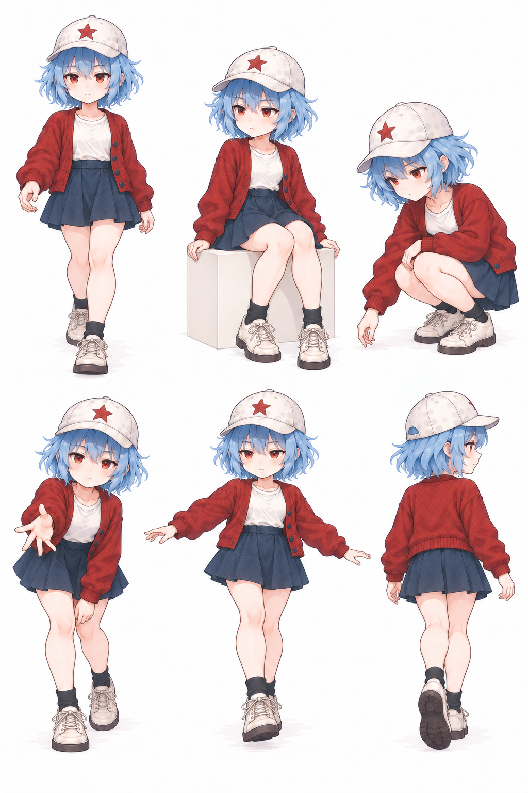
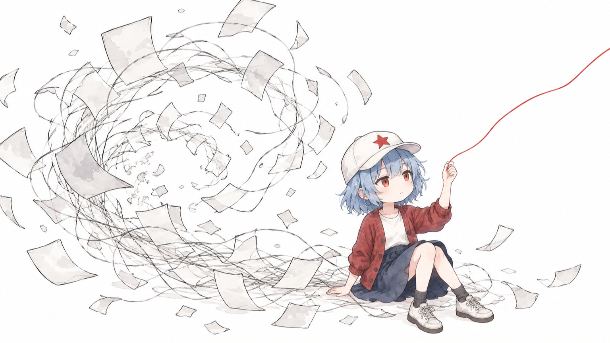
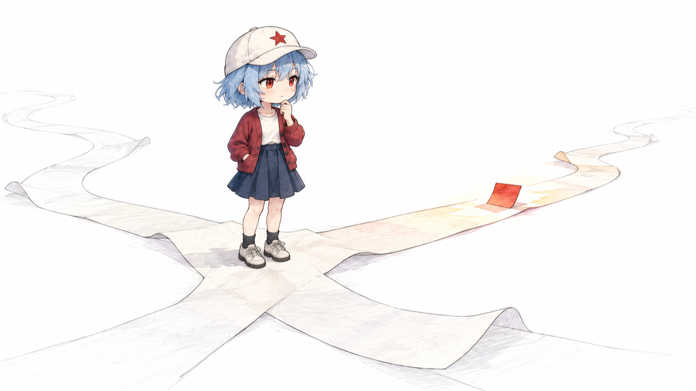

# 凯冰文章配图与封面

> 用固定的凯冰 V2 日系休闲形象，为中文文章创作正文隐喻配图与封面主视觉。

正文：16:9 横版、白底轻手绘 · 封面：聚焦主题、适配缩略图与平台裁切 · Codex Skill

## 当前版本是什么

这是一个面向中文文章的 Codex Skill。正文模式先理解文章中的认知锚点，再为值得配图的锚点发明可见场景，让凯冰进入核心因果关系；封面模式从定稿标题和文章核心承诺提炼一个清楚的主视觉张力。

当前正式支持：

- 分析文章并规划正文配图 shot list
- 生成单张或成组的正文隐喻配图，修改已有正文图
- 从定稿标题和核心承诺生成文章封面主视觉，检查缩略图识别与平台裁切
- 保持凯冰 V2 在正文与封面中的身份一致性

封面与正文图是两种模式：正文图解释关系，封面帮助读者在缩略图中认出主题与张力，各自使用不同的构图和验收规则。角色设定稿不在本 Skill 的生成范围内。

## 凯冰 V2

凯冰是一位清新、安静、有主见的日系休闲少女。她不是战士、工作人员或内容助手，也不是贴在画面角落的吉祥物。

稳定识别点：

- 白色休闲棒球帽，正面红色五角星
- 冰蓝色齐下巴短发
- 柔和暗红色针织开衫
- 象牙白上衣与藏青短裙
- 红橙色眼睛与克制、自然的表情

### V2.1 身份母版


### 五视图结构


### 头部四视图


### V2.2 正文轻 Q 形态母版



### V2.2 正文轻 Q 形态四视图



V2.2 不再把标准角色整体压矮。它在保持成年脸、总高度感和清楚骨架的前提下，相对放大头部、适度缩短躯干与四肢，并同步缩短开衫和裙长。四个角度来自同一张统一画布，服装节点与脚底线保持一致。

### V2.2 表情与动作范围





## 正文配图效果

### 信息过载：从噪声中牵住一根清晰线索



### 决策路径：在分岔处发现一个值得靠近的方向



### 选择与放下：牵住一个方向，同时放开其他可能


这些图片用于校准角色身份、线条、留白和参与方式，不是可复用的构图模板。每篇文章都应重新发明隐喻。

## 正文配图视觉原则

- 默认 16:9 横版，白色或极浅暖白背景
- 轻而自然的手绘线条，少量克制水彩
- 一张图只表达一个核心关系
- 凯冰通常占画面约 15%–30%
- 默认无文字；确有必要时只使用 1–3 个短中文标注
- 凯冰可以经历、选择、承受、同行或轻微影响场景，不必每次操作机器；单纯旁观不算参与
- 不做 PPT、复杂架构、真实 UI、战斗海报或角色站桩图

## 封面视觉原则

- 围绕一个文章主对象与一处可见张力，不把多个案例拼成海报目录
- 凯冰参与主动作；封面可采用更近的景别，不强制沿用正文远景比例
- 默认生成无字主视觉并保留标题安全区；需要图内短标题时逐字检查
- 按目标平台检查裁切，并在约 240px 宽的缩略图下验证辨识度

## 固定身份，开放表达

- 固定凯冰的脸、帽星、发型、服装结构、配色和轻 Q 身体逻辑。
- 不固定每篇文章的隐喻物件、动作、观察角度、角色站位或参与方式。
- 先从文章发明隐喻，再按需加载最少的角色参考；不能从已有姿势反向套用文章。
- 表情与动作单图是可选纠偏样本，不是模板清单。同一语义有多个合格方案时，应保留变化并避免连续复用。

## 安装

```bash
git clone https://github.com/ruijayfeng/kevinbee-illustrations.git
cd kevinbee-illustrations
mkdir -p "${CODEX_HOME:-$HOME/.codex}/skills"
cp -R ./kevinbee-illustrations "${CODEX_HOME:-$HOME/.codex}/skills/"
```

安装后可以这样调用：

```text
Use $kevinbee-illustrations 为这篇中文文章规划并生成几张凯冰 V2 正文配图。
```

## 与文章生产套件的关系

本仓库的 [`kevinbee-illustrations/`](kevinbee-illustrations/SKILL.md) 是凯冰配图 Skill 的唯一维护源。文章选题、写作、配图和排版需要串联时，使用 [凯冰内容生产套件](https://github.com/ruijayfeng/kevinbee-article-suite)；套件通过 Git 子模块引用本仓库，并不维护另一份配图规则或角色资产。

两边按已验证的提交同步：本仓库更新后，套件核对兼容性并推进子模块锁定点，而不是复制文件或自动追踪分支最新提交。只有跨 Skill 的阶段路由、材料交接和平台交付属于套件自身规则，见[套件 Skill 的维护说明](https://github.com/ruijayfeng/kevinbee-article-suite/blob/main/.agents/skills/kevinbee-article-suite/README.md)。

## 使用方式

### 只规划，不生图

```text
Use $kevinbee-illustrations 先不要生成图片。
分析下面这篇文章，挑选真正值得视觉化的认知锚点，给出 4–6 张 shot list。

<粘贴文章>
```

### 直接生成

```text
Use $kevinbee-illustrations 为下面这篇文章生成 4 张正文配图。
保持凯冰 V2 形象一致；默认无文字，每张只表达一个核心关系。

<粘贴文章>
```

### 单个观点

```text
Use $kevinbee-illustrations 为这个观点生成一张正文配图：

真正的选择不是找到最亮的路，而是放弃其他同样可能的路。
```

### 修改已有图片

```text
Use $kevinbee-illustrations 编辑这张图：
保持凯冰身份、姿态和核心隐喻不变，只删除错误文字，不新增物件。
```

### 生成文章封面

```text
Use $kevinbee-illustrations 为这篇已定稿文章生成一张封面主视觉。
标题：<定稿标题>
目标平台：<平台或所需画幅>
依据正文提炼一个主对象和一个核心张力；默认无字，留出标题安全区。

<粘贴文章>
```

更多调用示例见 [examples/prompts.md](examples/prompts.md)。

## Skill 的工作方式

正文模式：找出文章的核心判断和转折，只在需要解释关系的位置发明隐喻；让凯冰进入核心因果关系，检查身份、参与方式与画幅，保存原图及最终正文版本。标准与近景使用 V2.1 身份层，正文全身使用 V2.2 轻 Q 层。

封面模式：依据定稿标题和文章核心承诺，聚焦一个主对象与张力；让凯冰参与，保留标题和裁切安全区，检查原尺寸与缩略图。封面不直接放大正文隐喻图，也不伪装成角色海报。

## 目录结构

```text
.
├── README.md
├── examples/
│   └── prompts.md
├── docs/
│   ├── character-direction-v2.md
│   └── upstream-analysis.md
├── archive/
│   ├── legacy-v1/                # 旧战斗形象与旧案例
│   └── development-v2/           # V2 探索、废弃比例与过渡资产
├── tests/
│   └── article-body/             # 前向测试、失败对照、原图与最终裁切
└── kevinbee-illustrations/
    ├── SKILL.md
    ├── agents/
    │   └── openai.yaml
    ├── assets/
    │   ├── manifest.yaml
    │   ├── ip-reference/
    │   └── article-examples/
    ├── references/
    │   ├── ip-core.md
    │   ├── character-model-v2.2.md
    │   ├── article-body-style.md
    │   ├── article-body-prompt.md
    │   ├── cover-style.md
    │   ├── cover-prompt.md
    │   ├── cover-qa.md
    │   ├── composition-patterns.md
    │   └── qa-checklist.md
    └── scripts/
        └── validate.py
```

真正安装到 Codex 的目录只有 `kevinbee-illustrations/`。`archive/` 和 `tests/` 保留设计证据与前向测试，但不进入默认生成上下文。

## 设计上的单一真值

- 凯冰是谁：只由 `references/ip-core.md` 定义
- 比例、角度与参考选择：由 `references/character-model-v2.2.md` 定义
- 正文图长什么样：由 `references/article-body-style.md` 定义
- 如何构造提示词：由 `references/article-body-prompt.md` 定义
- 如何发明隐喻：由 `references/composition-patterns.md` 定义
- 如何验收：由 `references/qa-checklist.md` 定义
- 封面视觉、提示词与验收：分别由 `references/cover-style.md`、`references/cover-prompt.md`、`references/cover-qa.md` 定义
- 哪张图该在何时加载：由 `assets/manifest.yaml` 定义

正文依赖顺序是：角色身份 → 角色结构 → 隐喻构图 → 正文风格 → 提示词 → QA。封面另按封面视觉、提示词与验收规则执行。后层不得重写前层，测试和历史资产也不得进入运行时清单。

## 上游与署名

本项目基于 [helloianneo/ian-xiaohei-illustrations](https://github.com/helloianneo/ian-xiaohei-illustrations) 演化而来，继承了“认知锚点、一图一义、物理隐喻”的文章配图方法，并重新设计了 KevinBee 角色与生成结构。

详细溯源与差异分析见 [docs/upstream-analysis.md](docs/upstream-analysis.md)。

作者：凯冰（KevinBee）

- GitHub：[ruijayfeng](https://github.com/ruijayfeng)
- 微信：`STAR2023415`
- 邮箱：`fz.dev@foxmail.com`

## License

MIT License。详见 [LICENSE](LICENSE) 与 [NOTICE.md](NOTICE.md)。
