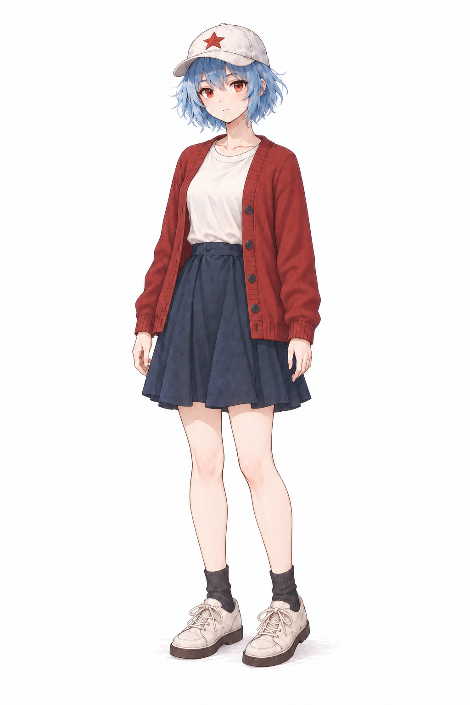
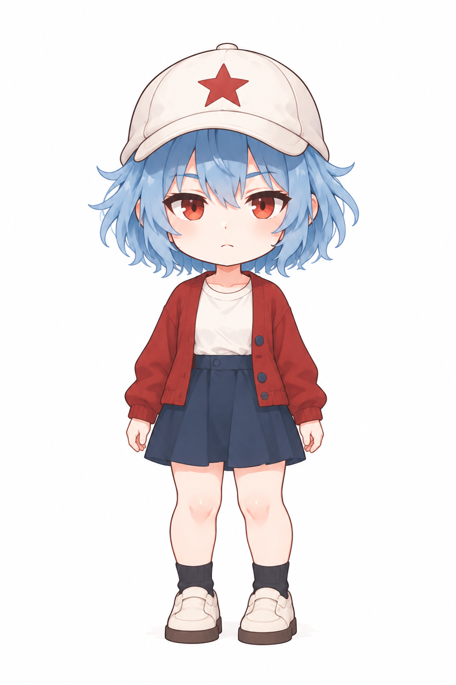

# 凯冰文章配图与封面

这个 Codex Skill 为中文文章规划、生成或修改正文隐喻配图与封面。凯冰的帽星、蓝发、红色开衫和气质保持一致；每篇文章的隐喻、动作与构图从正文重新构思。

| 用途 | 人物形态 | 画面任务 |
|---|---|---|
| 正文配图 | 正文 Q 版 | 解释一个认知关系或变化，默认 16:9、浅色留白 |
| 文章封面 | 标准形态 | 在缩略图中呈现主题与张力，按目标平台验裁切和文字 |

封面默认采用标准形态；正文 Q 版不自动用于封面。角色设定稿不属于这个 Skill 的生成任务。

## 安装

```bash
git clone https://github.com/ruijayfeng/kevinbee-illustrations.git
cd kevinbee-illustrations
mkdir -p "${CODEX_HOME:-$HOME/.codex}/skills"
cp -R ./kevinbee-illustrations "${CODEX_HOME:-$HOME/.codex}/skills/"
```

## 使用

只规划正文图片：

```text
Use $kevinbee-illustrations 分析下面的文章，找出真正需要视觉解释的位置，给出 shot list，先不要生图。

<粘贴文章>
```

生成正文图片：

```text
Use $kevinbee-illustrations 为下面的文章生成正文隐喻配图。先从文章构思每张图的关系、动作和构图，再选择凯冰正文 Q 版参考。

<粘贴文章>
```

生成封面：

```text
Use $kevinbee-illustrations 为这篇已定稿文章生成封面。
标题：<文章标题>
目标平台或画幅：<平台或尺寸>
使用凯冰标准形态；根据正文确定主对象、核心张力和封面短主题词。
参考封面研究图对整体布局、思路发散、凯冰参与和标题安排的拆解，为这篇文章重新构思画面；人物身份由标准形态母版校准。

<粘贴文章>
```

若只提供文章长标题，封面短词按 Skill 规则确认；明确要求无字版时保留排字区域。图片生成、裁切、文字和缩略图验收流程详见 [SKILL.md](kevinbee-illustrations/SKILL.md)。

## 角色参考

| 标准封面形态 | 正文 Q 版 |
|---|---|
|  |  |

标准形态母版及各角度全身图已统一收敛落肩线与上臂袖量，可用于校准身份和肩袖轮廓。新封面仍需按具体动作、景别和最终裁切检查肩峰、袖量与剪影。

## 专门的封面功能与案例

封面模式会从文章提炼主对象与一处核心张力，安排凯冰的神情、动作、景别、占比和短标题，再检查实际画幅、目标裁切和缩略图。完整流程见 [SKILL.md](kevinbee-illustrations/SKILL.md)；研究图的设计拆解见 [封面研究图](kevinbee-illustrations/references/cover-examples.md)。

| 既有文章封面 | 内容构思研究 |
|---|---|
| [微缩房间](kevinbee-illustrations/assets/cover/editorial-examples/seed-miniature-room.png) · [纳米工作](kevinbee-illustrations/assets/cover/editorial-examples/nano-work.png) · [远程协助](kevinbee-illustrations/assets/cover/editorial-examples/remote-assistance.png) | [多结果分岔](kevinbee-illustrations/assets/cover/concept-studies/qwen-branching.png) · [进入产品世界](kevinbee-illustrations/assets/cover/concept-studies/hyper3d-forward.png) · [动作冲击](kevinbee-illustrations/assets/cover/concept-studies/fighting-skill-impact.png) · [一次示范带出后续](kevinbee-illustrations/assets/cover/concept-studies/teach-once-causal.png) |

这些成图用于研究整体布局、思路发散、凯冰如何进入事件，以及短标题如何承担信息。每篇文章都从内容提出不同的可见事件，重新决定隐喻、动作、构图和文字位置；案例图不作为生图输入或套用模板。标准形态母版负责人物身份；四张内容构思研究图的肩袖比例尚未合格，不作为人物比例参考。

## 当前目录

```text
kevinbee-illustrations/
├── SKILL.md
├── agents/openai.yaml
├── assets/
│   ├── manifest.yaml
│   ├── identity/
│   │   ├── standard/       # 封面标准形态与角度、头部参考
│   │   └── article-q/      # 正文 Q 版与角度参考
│   └── cover/              # 封面设计案例，按需人工复盘
├── references/            # 身份、构思、风格、提示词和验收规则
└── scripts/validate.py
```

`assets/manifest.yaml` 是图片选择清单；`references/character-model.md` 说明两种形态的使用边界。仓库当前文件树只保留 Skill 可用材料；探索、测试和过渡资产仍可从 Git 历史恢复，不用目录名充当版本号。

## 来源与许可

本项目从 [Ian Xiaohei Illustrations](https://github.com/helloianneo/ian-xiaohei-illustrations) 的文章配图方法演化，重做了凯冰角色与 Skill 结构。详见 [NOTICE.md](NOTICE.md) 和 [LICENSE](LICENSE)。

作者：凯冰（KevinBee） · [GitHub](https://github.com/ruijayfeng) · `fz.dev@foxmail.com`
